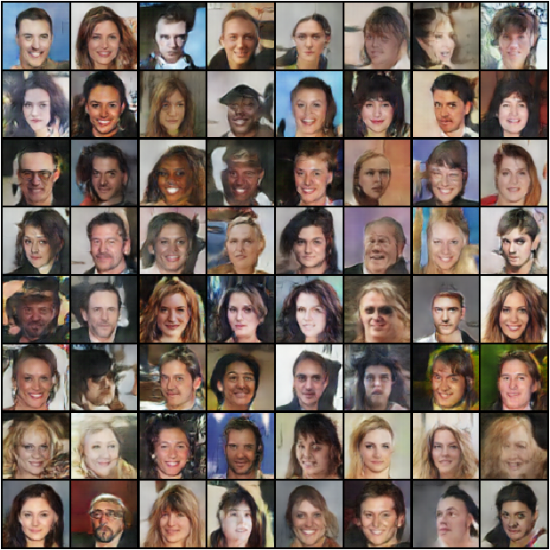
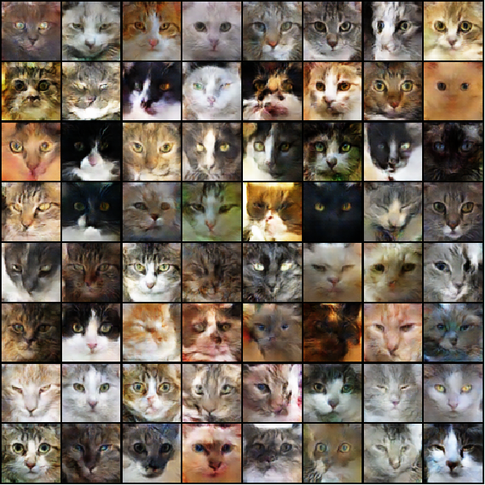

# PyGANs
A collection of GANs implemented with PyTorch

## DCGAN
A Deep Convolutional GAN that can generate novel images that resemble the original datset

### Celebrity sample results

### Dog sample results

### Cat sample results

### Pokemon sample results

<!-- ## CycleGAN
A GAN that can change the texture of images

### Monet to Photo

### Photo to Monet -->
